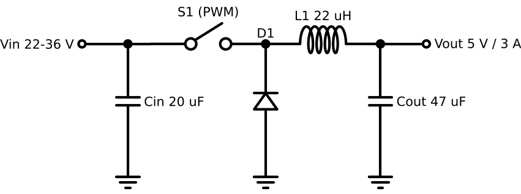
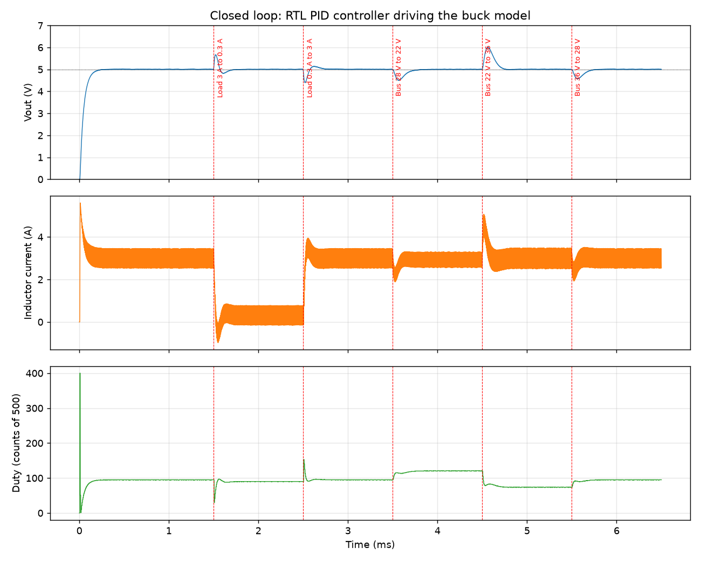
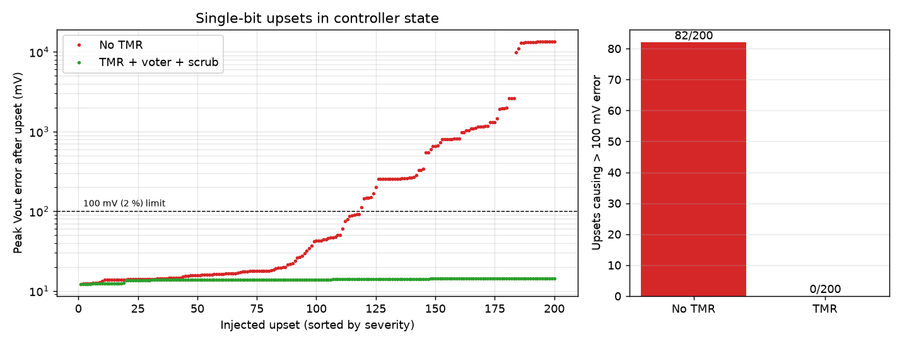

# Spacecraft 28 V Bus Buck Converter: power stage, digital control and radiation-tolerant controller

Simulation study of a 28 V (22 to 36 V) to 5 V / 3 A buck converter for a spacecraft power bus.
It covers three things in one repo:

1. **Power stage design** in SPICE (LTspice / ngspice): component sizing, corner analysis, derating.
2. **Digital control in Verilog**: fixed-point PID voltage-mode controller and PWM generator, written as synthesisable RTL and checked in simulation against a bit-exact Python model.
3. **Single-event-upset (SEU) tolerance**: triple modular redundancy (TMR) with a majority voter and per-period scrubbing, tested by injecting 200 random bit flips into the controller state.

**Status: simulation only.** No hardware has been built and the RTL has not been synthesised for an FPGA yet (see "Limitations" and "Next steps").



## Headline results

| Item | Result |
|---|---|
| Efficiency, 3 A load, 22 to 36 V in (SPICE, conduction losses only) | 91.1 to 92.4 % |
| Output ripple, worst case across 18 corners (SPICE) | 21 mV pk-pk |
| Steady-state regulation, closed loop (Verilog sim) | 5.006 V |
| Phase / gain margin, worst case (frequency response of the loop) | 45 deg / 8.8 dB |
| Settling after load or line step | 180 to 240 us (to +/-50 mV) |
| RTL vs Python golden model | 1299 / 1299 control ticks identical |
| Bit-flip faults causing > 100 mV error, **no TMR** | 82 / 200 (worst case 13.4 V) |
| Bit-flip faults causing > 100 mV error, **with TMR** | 0 / 200 |

Known shortfall: load and line steps cause 430 to 1010 mV excursions (9 to 20 %). See `docs/test_report.md` for why and what to change.




## Repository layout

```
spice/      buck_open_loop.cir, buck_load_step.cir   power stage netlists (LTspice and ngspice)
rtl/        pwm_gen.v, pid_ctrl.v, tmr_voter.v, buck_ctrl_top.v   synthesisable Verilog
tb/         buck_plant.v, tb_buck_loop.v, tb_fault_inject.v       testbenches (not synthesisable)
scripts/    run_spice.py, tune_pid.py, loop_margins.py, golden_model.py, plot_results.py, draw_schematic.py
docs/       design_note.md, test_report.md, schematic.png
results/    plots, CSV logs and auto-generated summary tables
```

## How to run

Needs: Icarus Verilog (`iverilog`, `vvp`), ngspice, Python 3 with numpy, scipy, matplotlib, schemdraw.

```
pip install -r requirements.txt
make sim golden        # closed-loop simulation + bit-exact check (seconds)
make fault             # 2 x 200 fault injections (about 40 s)
make plots             # figures and tables in results/
make spice             # SPICE corner sweep (about 3 min)
make all               # everything
```

Open `spice/buck_open_loop.cir` directly in LTspice (File > Open, then Run) to see the power stage waveforms. Waveforms from the Verilog run can be viewed from `results/loop_log.csv`.

## How it works, briefly

* The ADC code is sampled once per switching period (200 kHz). The PID computes the new duty in one clock cycle and applies it to the next period.
* PID: `e = VREF - adc`, integrator with clamping anti-windup, derivative on error, all in integer maths with gains scaled by 2^16. Gains were tuned on an averaged model (`scripts/tune_pid.py`) for at least 45 degrees of phase margin at every Vin and load corner (`scripts/loop_margins.py`).
* TMR: the 58-bit controller state (integrator, previous error, duty) is stored three times. Every read goes through a bitwise 2-of-3 voter, and the voted next state is written back to all three copies every period, so a single upset is both masked and scrubbed. A mismatch flag is raised for telemetry.
* Fault injection: a random bit of a random copy is flipped at a random time, then Vout is watched for 300 us. The same bit and time sequence is replayed with TMR off and on.

## Limitations (please read)

* **Simulation only.** No PCB, no hardware, no FPGA synthesis or timing report yet.
* The SPICE power stage uses an ideal switch plus a Schottky diode and has **no switching losses or gate-drive loss**, so efficiency is optimistic. Most of the loss is diode conduction, so a synchronous rectifier should help (not simulated).
* The Verilog loop simulation uses a behavioural synchronous buck (forced continuous conduction, inductor current can go negative). It does not model discontinuous mode, ADC noise, ESR or temperature drift of parts.
* Fault injection flips bits in the controller state only. It does not model upsets in the PWM counter, ADC path, clock, configuration memory, or multiple-bit upsets between scrubs. Real radiation tolerance also needs part selection and testing, which this repo does not cover.
* There is no output over-voltage protection, so an uncorrected upset lets Vout rise far past 5 V in the model (13 V). A real design needs an independent OVP.
* The 22 to 36 V bus range and 5 V / 3 A load are assumptions chosen for this study, not taken from a specific mission standard.

## Next steps

1. Add Vin feedforward and a larger output capacitor to cut load and line step excursions.
2. Replace the diode with a synchronous rectifier and re-run efficiency.
3. Synthesise `rtl/` for a small FPGA (for example iCE40 with yosys/nextpnr, or Xilinx Vivado) and report resource use and timing.
4. Add a hardware-in-the-loop version with a prototype board.
5. Add soft start and an OVP comparator.

## Licence

MIT. See `LICENSE`.
